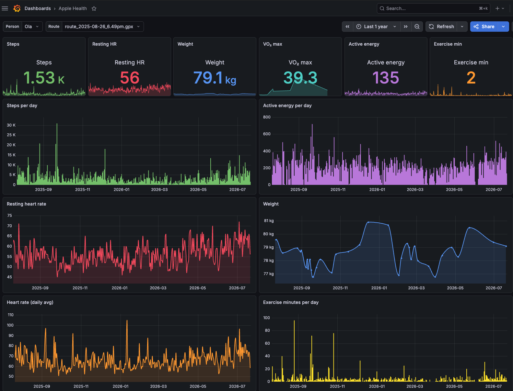
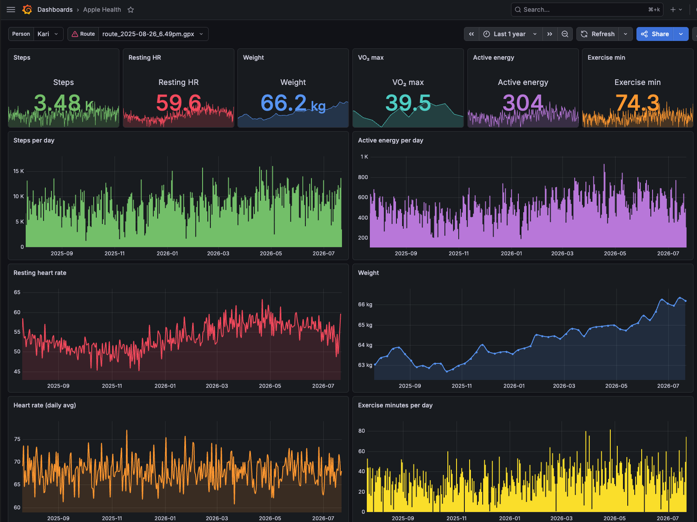
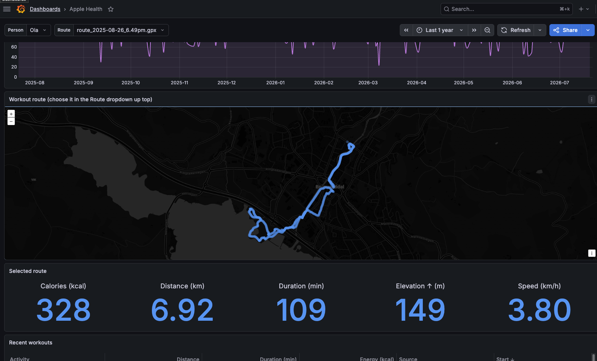

# AHDX — Apple Health Data eXporter

Your Apple Health history, out of Apple's black box and into a plain SQLite
database you own, with a Grafana dashboard on top. It runs in Docker and works
on Windows, Mac, or Linux.

You're in the EU (or you just think your health data is yours), so here's a way
to actually keep it and look at it. Nothing is sent anywhere. The only time AHDX
touches the network is to load map tiles when you open a workout route.

## What it looks like

Steps, resting heart rate, weight, VO₂ max, sleep with a score, and your workout
routes on a real map, per person:





Each workout route on a map, with its own stats — distance, time, calories,
elevation, pace:



## Get it running

You need Docker (Docker Desktop on Windows/Mac, or Docker Engine on Linux).

```
git clone <your-repo-url> ahdx
cd ahdx
docker compose up -d --build
```

That starts two things: **AHDX** on http://localhost:8088 and **Grafana** on
http://localhost:3000. Grafana waits for AHDX to be healthy before it starts, so
the first boot takes a minute.

Open http://localhost:8088. On the first visit it asks you to **set a password**.
That password is stored salted in AHDX, and it also becomes the Grafana admin
password (user `admin`), so you set it once and it works for both.

Your data lives in `./data` next to the compose file. Blow away the containers
whenever you want; the databases stay.

## Get your data out of the iPhone

1. Open **Health**, tap your profile picture, choose **Export All Health Data**.
2. You get an `export.zip`. Send it to your computer.
3. In AHDX, go to **Import** and drop the zip in. Big exports take a few minutes;
   the page shows a running count.

Loading a newer export later only adds what's new, so re-exporting every month
doesn't make duplicates.

Two ways to keep it fresh without clicking, both free:

- **Watched folder** — drop an export into `data/inbox/` and AHDX imports it on a
  timer (every 30 min by default), then moves it to `data/inbox/done/`.
- **Push from the phone** — a free iOS **Shortcut** can POST recent metrics to
  `/ingest` on a schedule. See the steps further down.

Apple has no free server-side API, so a fully automatic *full-history* export
isn't possible — that part stays a manual tap. Automatic *recent* data works fine
through the Shortcut.

## More than one person

Each person is their own database. On the **Databases** page you can create,
rename, switch, and delete them, and see each one's size and record counts.
Imports go into whichever database is active.

In Grafana, the **Person** dropdown up top switches the whole dashboard between
them.

## The Grafana dashboard

It ships already set up — the AHDX datasource and the "Apple Health" dashboard
are provisioned from files, so there's nothing to import. Panels:

- Latest weight, resting HR, VO₂ max, steps, active energy, exercise minutes.
- Steps, heart rate, weight, and energy over time.
- **Sleep**: a nightly score (0–100), stage breakdown (deep / core / REM / awake),
  and the score trend. The score is computed from sleep duration, efficiency, and
  how much deep/REM you got — Apple doesn't provide one.
- **Workout route** on an OpenStreetMap map, with a box under it showing the
  activity, distance, duration, calories, elevation gain, and average speed.

## The read API

AHDX exposes a small read API at `/api` (open it in a browser for the menu). It's
what Grafana reads, and you can point your own scripts at it. Pick a person with
`?db=Name`:

```
/api/daily?db=Ola&type=HKQuantityTypeIdentifierStepCount&agg=sum
/api/sleep?db=Ola
/api/routes?db=Ola
```

Set `AHDX_API_KEY` in the compose file if you want to require an `X-Api-Key`
header on it.

## Building the iOS Shortcut (the auto-trickle)

This sends today's step samples; copy the pattern for other metrics.

1. New Shortcut. Add **Find Health Samples** — Type *Steps*, sorted by End Date,
   filtered to "within the last 1 day".
2. Add **Repeat with Each**. Inside it, build a **Dictionary** with keys `type`
   (`HKQuantityTypeIdentifierStepCount`), `value` (the item's Value), `unit`
   (`count`), `start_date`, `end_date`, `source_name`, then **Add to Variable**
   `rows`.
3. After the loop, a **Dictionary** with one key `records` set to `rows`.
4. **Get Contents of URL** — POST to `http://<your-pc-ip>:8088/ingest`, body JSON,
   pass that dictionary.
5. In the **Automation** tab, run it on a schedule and turn off "Ask Before
   Running".

## Configuration

Everything has a sane default; override in a `.env` file or the compose file.

| Setting | Default | What it does |
|---|---|---|
| `AHDX_PORT` | `8088` | Host port for the app |
| `GRAFANA_PORT` | `3000` | Host port for Grafana |
| `AHDX_AUTH` | `true` | Password-protect the UI |
| `AHDX_SCAN_INTERVAL` | `1800` | Inbox check interval, seconds (0 = off) |
| `AHDX_API_KEY` | *(empty)* | If set, the read API requires this header |

## What's in the database

Three tables that mirror the export: `records` (one row per measurement),
`workouts`, and `activity_summary`. Plus `routes`/`route_points` and `ecg` when
you import the full zip. Open any `data/databases/*.db` in a SQLite browser and
it's all right there, no proprietary format.

## Privacy

No accounts, no analytics, no outbound calls — except loading map tiles from
OpenStreetMap when you open a route, and only then. Password hashes are salted.
Your health data never leaves the machine.

## License

MIT. See [LICENSE](LICENSE).
